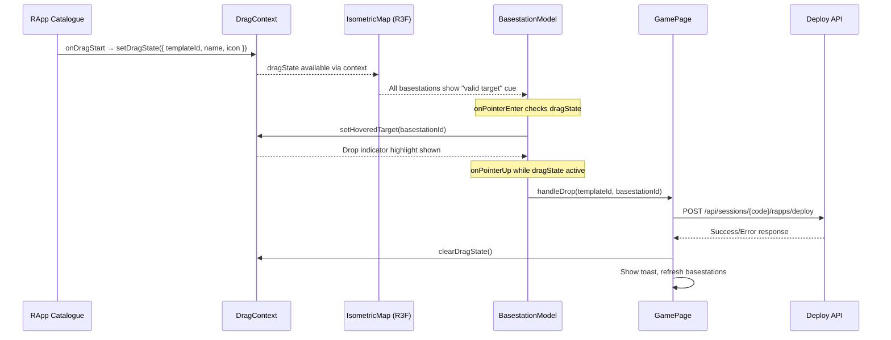

# Design Document: Game UI Redesign

## Overview

This design transforms the Game Page from a tabbed sidebar layout into a multi-panel layout with drag-and-drop rApp deployment. The two primary changes are:

1. **Drag-and-drop deployment**: Players drag rApp cards from the catalogue onto 3D basestations on the isometric map, replacing the modal-based deploy workflow.
2. **Simultaneous panel visibility**: The rApp Catalogue, Event Panel, and Leaderboard are all visible at once, eliminating tab navigation.

The key technical challenge is bridging HTML5 drag events (which work in the 2D DOM overlay) with the React Three Fiber canvas (which uses pointer events internally). The solution is a **hybrid approach**: track drag state in a React context, use HTML5 DnD for the catalogue cards, and detect drops on basestations via R3F pointer events that check the shared drag state.

## Architecture

### High-Level Layout

```
┌─────────────────────────────────────────────────────────────────┐
│  Game Page (flex row)                                           │
│ ┌───────────────────────────────────┐ ┌───────────────────────┐ │
│ │                                   │ │  Right Panel (w-72)   │ │
│ │                                   │ │ ┌───────────────────┐ │ │
│ │       Isometric Map (flex-1)      │ │ │  rApp Catalogue   │ │ │
│ │       (R3F Canvas)                │ │ │  (draggable cards) │ │ │
│ │                                   │ │ ├───────────────────┤ │ │
│ │    [Basestation Popover floats    │ │ │  Leaderboard      │ │ │
│ │     over map when BS clicked]     │ │ │  (compact)        │ │ │
│ │                                   │ │ └───────────────────┘ │ │
│ └───────────────────────────────────┘ └───────────────────────┘ │
│ ┌─────────────────────────────────────────────────────────────┐ │
│ │  Bottom Bar — Event Panel (h-36, horizontally scrollable)   │ │
│ └─────────────────────────────────────────────────────────────┘ │
└─────────────────────────────────────────────────────────────────┘
```

### Mobile Layout (< 768px)

```
┌─────────────────────────┐
│   Isometric Map          │
│   (full viewport)        │
│                          │
│  [Popover floats here]   │
│                          │
├──────────────────────────┤
│  Bottom Sheet            │
│  ┌──────────────────────┐│
│  │ Catalogue strip (h)  ││
│  │ ← scroll →           ││
│  └──────────────────────┘│
│  [Expand for Events/LB] │
└──────────────────────────┘
```

### Drag-and-Drop Data Flow



## Components and Interfaces

### New Components

#### 1. `DragProvider` / `useDrag` (Context + Hook)

Manages the shared drag-and-drop state across the DOM and R3F boundaries.

```typescript
interface DragState {
  templateId: number;
  name: string;
  icon: string;
}

interface DragContextValue {
  dragState: DragState | null;
  hoveredTargetId: number | null;
  startDrag: (state: DragState) => void;
  setHoveredTarget: (id: number | null) => void;
  endDrag: () => void;
}
```

**Location**: `frontend/src/context/DragContext.tsx`

#### 2. `DragPreview`

A fixed-position DOM element that follows the cursor during drag, showing the rApp name and icon.

```typescript
interface DragPreviewProps {
  name: string;
  icon: string;
  position: { x: number; y: number };
}
```

**Location**: `frontend/src/components/game/DragPreview.tsx`

Renders as a `position: fixed` element tracking `mousemove` / `dragover` events. Uses `pointer-events: none` so it doesn't interfere with drop detection.

#### 3. `BasestationPopover`

A floating panel anchored near the clicked basestation, containing the existing `BasestationDetail` content.

```typescript
interface BasestationPopoverProps {
  basestation: BasestationDetailData;
  anchorPosition: { x: number; y: number }; // screen coords from R3F projection
  onClose: () => void;
  onTune: (rappId: number, rappName: string, threshold?: number, aggressiveness?: string) => void;
  onDisable: (rappId: number) => void;
  onRollback: (rappId: number) => void;
}
```

**Location**: `frontend/src/components/game/BasestationPopover.tsx`

Positioned using `position: absolute` within the map container, offset from the anchor point. Constrained to not overflow into the right panel area (catalogue). Closes on outside click or Escape.

#### 4. `DeploymentPicker`

A lightweight keyboard-accessible dropdown for deploying rApps without drag-and-drop.

```typescript
interface DeploymentPickerProps {
  templateId: number;
  templateName: string;
  basestations: Array<{ id: number; name: string }>;
  onSelect: (basestationId: number) => void;
  onClose: () => void;
}
```

**Location**: `frontend/src/components/game/DeploymentPicker.tsx`

Opens when a catalogue card is activated via Enter/Space. Lists basestations, navigable with arrow keys, confirms with Enter, dismisses with Escape.

#### 5. `CatalogueStrip` (Mobile)

A horizontally scrollable compact version of the catalogue for mobile bottom sheet.

```typescript
interface CatalogueStripProps {
  rapps: RappTemplate[];
  onDeploy: (rapp: RappTemplate) => void;
  dragState: DragState | null;
}
```

**Location**: `frontend/src/components/game/CatalogueStrip.tsx`

### Modified Components

#### `GamePage.tsx`

- Remove `activeTab` state and tab navigation
- Wrap content in `DragProvider`
- Replace sidebar with right panel (Catalogue + Leaderboard stacked)
- Add bottom bar for Event Panel
- Add `BasestationPopover` rendering logic (anchored to map container)
- Add `handleDrop` callback that calls Deploy API
- Remove `DeployModal` usage (replaced by drag-and-drop + keyboard picker)

#### `RappCatalogue.tsx`

- Add `draggable` attribute to each card
- Add `onDragStart` handler that sets drag context state and `dataTransfer`
- Add visual dimming (opacity) on the card being dragged
- Add `onKeyDown` handler for Enter/Space to open `DeploymentPicker`
- Remove the "Deploy" button (deployment is now via drag or keyboard picker)

#### `IsometricMap.tsx`

- Consume `DragContext` to know when a drag is active
- Pass `isDragActive` prop to `BasestationModel` for visual cues
- Add `onPointerUp` handling on the canvas container to detect drops

#### `BasestationModel.tsx`

- Add `isDragActive` prop — when true, show subtle glow/outline indicating it's a valid drop target
- Add `onPointerEnter` / `onPointerLeave` — when drag is active, update `hoveredTargetId` in context
- Add `onPointerUp` — when drag is active, trigger the drop handler
- Add `isHoveredTarget` prop — when true, show strong highlight (drop indicator)

#### `BottomSheet.tsx`

- Adapt for mobile layout: show catalogue strip at top, expandable section for Events/Leaderboard

### Hook: `useDragDrop`

A convenience hook combining drag context consumption with drop handling logic.

```typescript
function useDragDrop() {
  const { dragState, hoveredTargetId, startDrag, setHoveredTarget, endDrag } = useDrag();
  
  // Track cursor position for DragPreview
  const [cursorPos, setCursorPos] = useState({ x: 0, y: 0 });
  
  // Handle the drop action
  const handleDrop = useCallback((basestationId: number) => {
    if (!dragState) return;
    // Trigger deploy API call
    onDeploy(dragState.templateId, basestationId);
    endDrag();
  }, [dragState, endDrag]);

  return { dragState, hoveredTargetId, cursorPos, startDrag, setHoveredTarget, endDrag, handleDrop };
}
```

## Data Models

### Drag State

```typescript
// Stored in DragContext
interface DragState {
  templateId: number;  // rApp template being dragged
  name: string;        // Display name for preview
  icon: string;        // Icon key for preview (maps to lucide icon)
}

// Full context state
interface DragContextState {
  dragState: DragState | null;       // null = no drag in progress
  hoveredTargetId: number | null;    // basestation ID being hovered during drag
}
```

### Popover Anchor Position

```typescript
// Computed by projecting 3D basestation position to 2D screen coords
interface PopoverAnchor {
  basestationId: number;
  screenX: number;  // pixels from left of map container
  screenY: number;  // pixels from top of map container
}
```

The anchor position is computed using Three.js `Vector3.project()` with the camera, then mapped to the map container's pixel coordinates. This is recalculated on camera movement (zoom/pan).

### Deploy Request (unchanged)

```typescript
// POST /api/sessions/{code}/rapps/deploy
interface DeployRequest {
  templateId: number;
  basestationId: number;
}
```

## Correctness Properties

*A property is a characteristic or behavior that should hold true across all valid executions of a system — essentially, a formal statement about what the system should do. Properties serve as the bridge between human-readable specifications and machine-verifiable correctness guarantees.*

### Property 1: Drag initiation preserves template identity

*For any* rApp template in the catalogue, initiating a drag on that template's card SHALL produce a drag state whose `templateId` matches the originating template's ID exactly.

**Validates: Requirements 1.1**

### Property 2: Drag cancellation resets state

*For any* active drag state (any templateId), releasing the drag outside a valid drop target SHALL result in the drag state being reset to null (idle), with no side effects (no API calls, no toasts).

**Validates: Requirements 1.4**

### Property 3: Drop triggers deploy with correct parameters

*For any* valid pair of (templateId, basestationId) where a drag is active and the pointer is released over that basestation, the system SHALL call the Deploy API with exactly that templateId and basestationId combination.

**Validates: Requirements 3.1**

### Property 4: Error messages propagate to user feedback

*For any* error message string returned by the Deploy API, the error toast notification SHALL contain that exact error message, and the drag state SHALL be reset to null.

**Validates: Requirements 3.4**

## Error Handling

### Drag-and-Drop Errors

| Scenario | Handling |
|----------|----------|
| Drop outside any basestation | Cancel drag silently, restore source card appearance |
| Deploy API returns 4xx/5xx | Show error toast with server message, reset drag state |
| Deploy API network timeout | Show "Network error — please try again" toast, reset drag state |
| Drag starts but component unmounts | `useEffect` cleanup in DragContext resets state |
| Multiple rapid drops | Disable drop targets while a deploy request is in-flight (optimistic lock via `isDeploying` state) |

### Popover Errors

| Scenario | Handling |
|----------|----------|
| Basestation data stale | Popover shows last-known data; real-time WebSocket updates refresh it |
| Camera moves while popover open | Recalculate anchor position on each frame (throttled to 10fps) |
| Popover would overflow viewport | Clamp position to stay within map container bounds |

### Keyboard Accessibility Errors

| Scenario | Handling |
|----------|----------|
| No basestations available | Deployment picker shows "No basestations available" message |
| Picker loses focus | Auto-close picker after 5s of no interaction |

## Testing Strategy

### Unit Tests (Example-Based)

Focus on specific interactions and rendering:

- **DragContext**: Verify `startDrag` sets state, `endDrag` clears state, `setHoveredTarget` updates target ID
- **RappCatalogue drag**: Verify `onDragStart` fires with correct template data, source card dims during drag
- **BasestationModel drop detection**: Verify `onPointerUp` during active drag triggers drop handler
- **BasestationPopover**: Verify renders with correct data, closes on Escape, closes on outside click
- **DeploymentPicker**: Verify arrow key navigation, Enter confirms, Escape dismisses
- **Layout**: Verify all three panels render simultaneously (no tabs), correct positioning classes
- **Mobile layout**: Verify bottom sheet renders catalogue strip at < 768px viewport
- **Error toasts**: Verify error messages display correctly after failed deploy

### Property-Based Tests

Using `vitest` with a property-based testing library (fast-check):

- **Property 1**: Generate random template IDs → verify drag state matches
- **Property 2**: Generate random drag states → verify cancel always resets to null
- **Property 3**: Generate random (templateId, basestationId) pairs → verify API called with exact params
- **Property 4**: Generate random error message strings → verify toast contains exact message

Each property test runs minimum 100 iterations and is tagged:
```
// Feature: game-ui-redesign, Property 1: Drag initiation preserves template identity
```

### Integration Tests

- Full drag-and-drop flow: drag from catalogue → hover basestation → drop → verify API call → verify toast
- Keyboard flow: focus card → Enter → select basestation → Enter → verify API call
- Popover flow: click basestation → verify popover → tune rApp → verify API call → close popover

### What Is NOT Tested with PBT

- Layout positioning (use snapshot/visual regression tests)
- 3D rendering and visual cues (manual QA)
- Mobile responsive behavior (example-based viewport tests)
- WebSocket real-time updates (integration tests with mock WS)
