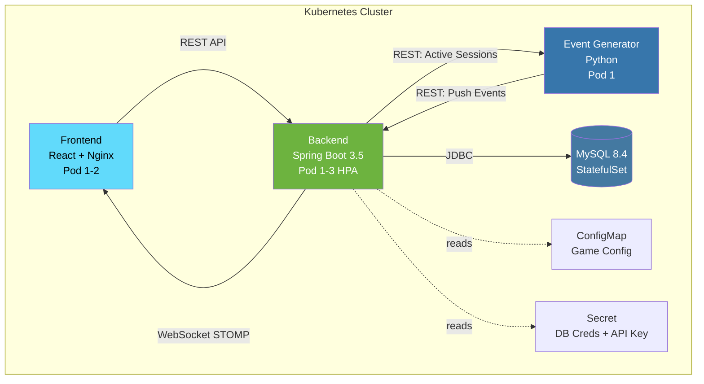
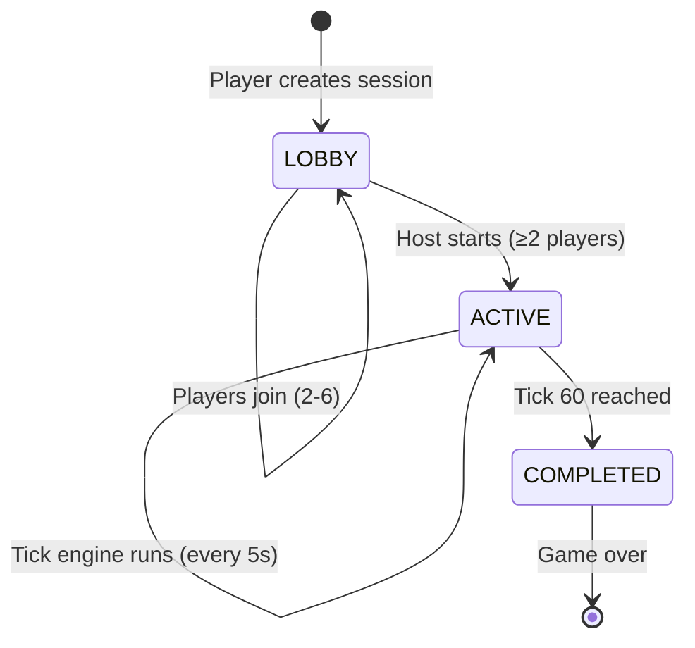
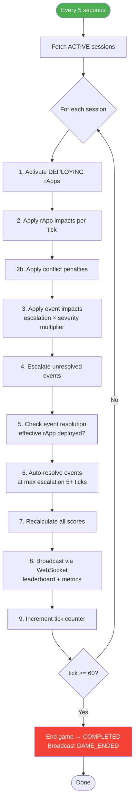
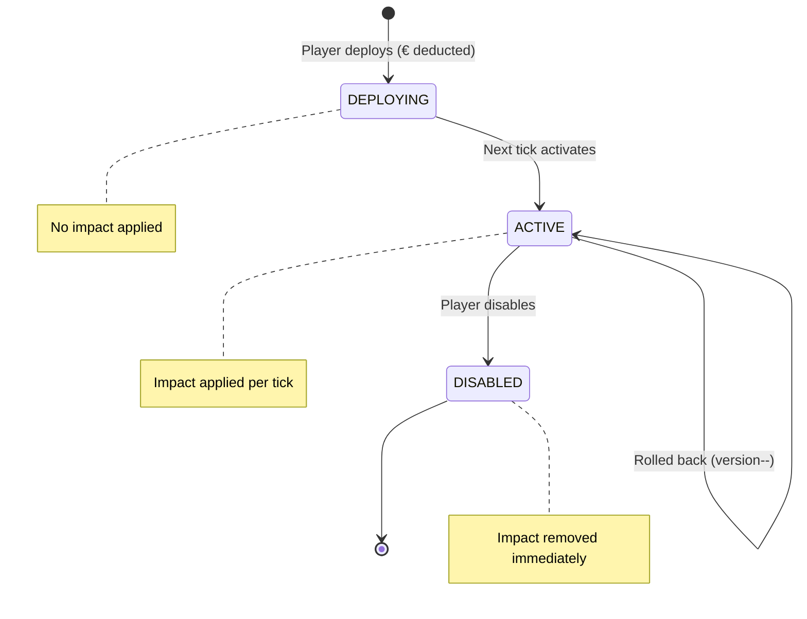
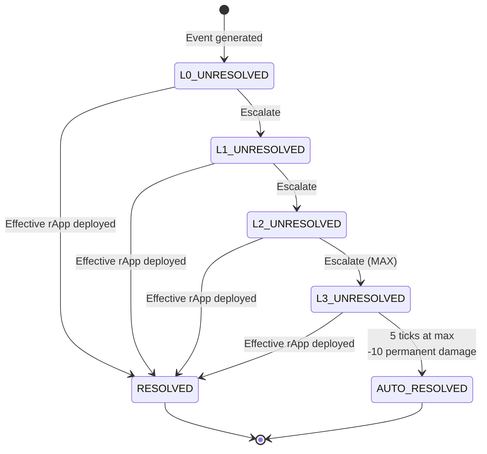
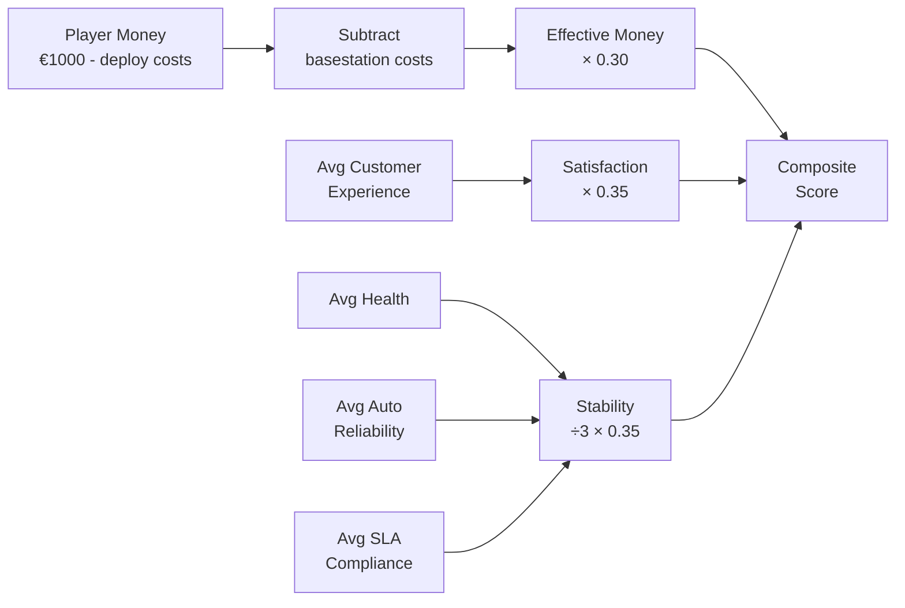
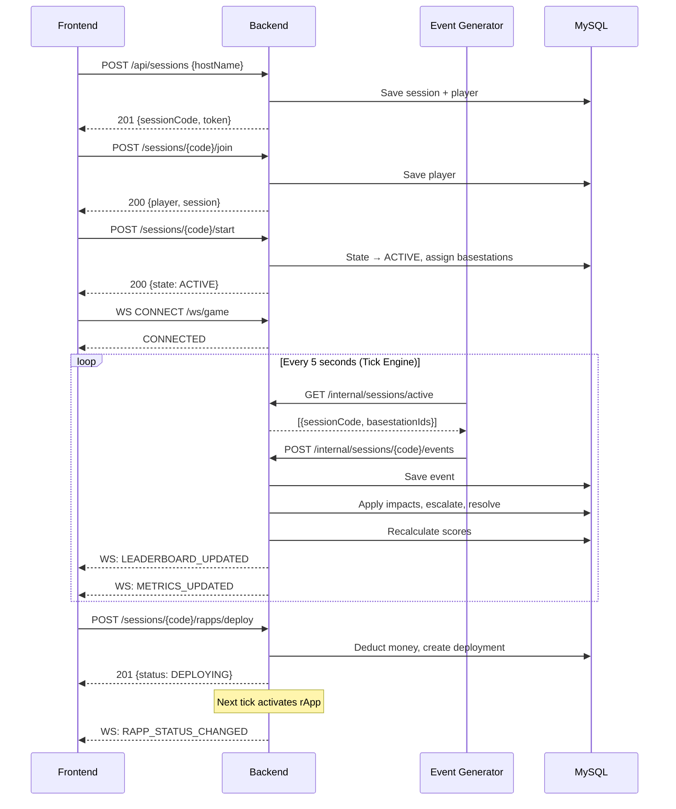

# rApp Tycoon — System Architecture & Gameplay Loop Diagrams

## 1. System Architecture

```
┌─────────────────────────────────────────────────────────────────────────────────┐
│                              KUBERNETES CLUSTER                                   │
│                                                                                   │
│  ┌─────────────────────┐         ┌──────────────────────────┐                   │
│  │     FRONTEND         │         │         BACKEND           │                   │
│  │     (React)          │         │      (Spring Boot)        │                   │
│  │                      │  REST   │                          │                   │
│  │  • Lobby UI          │────────►│  Controllers:            │                   │
│  │  • Game Board        │         │   • GameSessionController│                   │
│  │  • Basestation Map   │◄────────│   • BasestationController│                   │
│  │  • rApp Catalogue    │ WebSocket│   • RappController       │                   │
│  │  • Leaderboard       │  (STOMP)│   • CatalogueController  │                   │
│  │  • Event Alerts      │         │   • LeaderboardController│                   │
│  │                      │         │   • InternalEventCtrl    │                   │
│  │  Pod(s): 1-2         │         │                          │                   │
│  └─────────────────────┘         │  Services:               │                   │
│                                   │   • GameSessionService   │                   │
│                                   │   • PlayerService        │                   │
│  ┌─────────────────────┐         │   • BasestationService   │                   │
│  │   EVENT GENERATOR    │  REST   │   • RappService          │                   │
│  │     (Python)         │────────►│   • EventService         │                   │
│  │                      │         │   • ScoreService         │                   │
│  │  • Polls active      │◄────────│                          │                   │
│  │    sessions          │  REST   │  Simulation:             │                   │
│  │  • Generates events  │         │   • GameTickEngine       │                   │
│  │    (power outages,   │         │     (@Scheduled 5s)      │                   │
│  │    traffic spikes,   │         │                          │                   │
│  │    hardware failures)│         │  WebSocket:              │                   │
│  │                      │         │   • WebSocketBroadcaster │                   │
│  │  Pod: 1 (singleton)  │         │   • WebSocketAuthInterceptor│                │
│  └─────────────────────┘         │   • GameActionController │                   │
│                                   │                          │                   │
│                                   │  Pod(s): 1-3 (HPA)      │                   │
│                                   └────────────┬─────────────┘                   │
│                                                │                                  │
│                                                │ JDBC (Spring Data JPA)           │
│                                                ▼                                  │
│                                   ┌──────────────────────────┐                   │
│                                   │         MySQL 8.4         │                   │
│                                   │                          │                   │
│                                   │  Tables:                 │                   │
│                                   │   • game_session         │                   │
│                                   │   • player               │                   │
│                                   │   • basestation          │                   │
│                                   │   • rapp_template        │                   │
│                                   │   • rapp_deployment      │                   │
│                                   │   • game_event           │                   │
│                                   │                          │                   │
│                                   │  StatefulSet: 1 replica  │                   │
│                                   └──────────────────────────┘                   │
│                                                                                   │
│  ┌─────────────────────────────────────────────────────────────────────────────┐ │
│  │  ConfigMap: game.tick.interval=5000, game.tick.total=60, scoring weights    │ │
│  │  Secret: DB credentials, internal API key, session signing                  │ │
│  │  HPA: backend scales on CPU (1-3 replicas)                                  │ │
│  └─────────────────────────────────────────────────────────────────────────────┘ │
└─────────────────────────────────────────────────────────────────────────────────┘
```

## 2. Communication Flow

```
┌──────────┐                    ┌──────────┐                    ┌───────────┐
│ Frontend │                    │ Backend  │                    │  Event    │
│ (React)  │                    │ (Spring) │                    │ Generator │
└────┬─────┘                    └────┬─────┘                    └─────┬─────┘
     │                               │                                 │
     │  POST /api/sessions           │                                 │
     │──────────────────────────────►│                                 │
     │  201 {sessionCode, token}     │                                 │
     │◄──────────────────────────────│                                 │
     │                               │                                 │
     │  POST /api/sessions/X/join    │                                 │
     │──────────────────────────────►│                                 │
     │  200 {player, session}        │                                 │
     │◄──────────────────────────────│                                 │
     │                               │                                 │
     │  POST /api/sessions/X/start   │                                 │
     │──────────────────────────────►│  Assigns basestations           │
     │  200 {state: ACTIVE}          │  Starts tick engine             │
     │◄──────────────────────────────│                                 │
     │                               │                                 │
     │  WS CONNECT /ws/game          │                                 │
     │  (X-Session-Token header)     │                                 │
     │══════════════════════════════►│                                 │
     │  CONNECTED                    │                                 │
     │◄══════════════════════════════│                                 │
     │                               │                                 │
     │  SUBSCRIBE /topic/session/X/* │                                 │
     │══════════════════════════════►│                                 │
     │                               │                                 │
     │                               │  GET /api/internal/sessions/active
     │                               │◄────────────────────────────────│
     │                               │  200 [{sessionCode, basestationIds}]
     │                               │────────────────────────────────►│
     │                               │                                 │
     │                               │  POST /api/internal/sessions/X/events
     │                               │◄────────────────────────────────│
     │                               │  201 {eventId}                  │
     │                               │────────────────────────────────►│
     │                               │                                 │
     │  ◄─── TICK ENGINE (every 5s) ─┤                                 │
     │                               │                                 │
     │  WS: LEADERBOARD_UPDATED      │                                 │
     │◄══════════════════════════════│                                 │
     │  WS: METRICS_UPDATED          │                                 │
     │◄══════════════════════════════│                                 │
     │  WS: EVENT_OCCURRED           │                                 │
     │◄══════════════════════════════│                                 │
     │                               │                                 │
     │  POST /api/sessions/X/rapps/deploy                              │
     │──────────────────────────────►│                                 │
     │  201 {status: DEPLOYING}      │                                 │
     │◄──────────────────────────────│                                 │
     │                               │                                 │
     │  ◄─── NEXT TICK ─────────────┤                                 │
     │  WS: RAPP_STATUS_CHANGED      │  (DEPLOYING → ACTIVE)          │
     │◄══════════════════════════════│                                 │
     │                               │                                 │
```

## 3. Gameplay Loop (Tick Engine)

```
┌─────────────────────────────────────────────────────────────────────────┐
│                    GAME TICK ENGINE (every 5 seconds)                     │
│                                                                           │
│  For each ACTIVE game session:                                           │
│                                                                           │
│  ┌─────────────────────────────────────────────────────────────────────┐ │
│  │ STEP 1: ACTIVATE DEPLOYING rApps                                     │ │
│  │                                                                       │ │
│  │  Find all rApps with status=DEPLOYING                                │ │
│  │  Set status → ACTIVE                                                  │ │
│  │  (They were deployed last tick, now ready to apply impact)           │ │
│  └─────────────────────────────────────────────────────────────────────┘ │
│                              ▼                                            │
│  ┌─────────────────────────────────────────────────────────────────────┐ │
│  │ STEP 2: APPLY rApp IMPACTS (per tick)                                │ │
│  │                                                                       │ │
│  │  For each basestation:                                                │ │
│  │    For each ACTIVE rApp on that basestation:                         │ │
│  │      Calculate impact using Strategy pattern (with aggressiveness)   │ │
│  │      Apply to basestation metrics (clamped 0-100)                    │ │
│  │                                                                       │ │
│  │  Example: Energy Saver (MODERATE) → +20 energy, -5 custExp, -30 cost│ │
│  └─────────────────────────────────────────────────────────────────────┘ │
│                              ▼                                            │
│  ┌─────────────────────────────────────────────────────────────────────┐ │
│  │ STEP 2b: APPLY CONFLICT PENALTIES (per tick)                         │ │
│  │                                                                       │ │
│  │  For each basestation with 2+ active rApps:                          │ │
│  │    Check all pairs against conflict rules:                           │ │
│  │      • Energy Saver + Capacity Optimiser → -10 custExp, -5 energy   │ │
│  │      • Fault Predictor + Alarm Noise Reducer → -5 health, -8 autoRel│ │
│  │      • Traffic Balancer + Energy Saver → -7 energy, +15 cost        │ │
│  │    Apply penalty to basestation metrics                              │ │
│  └─────────────────────────────────────────────────────────────────────┘ │
│                              ▼                                            │
│  ┌─────────────────────────────────────────────────────────────────────┐ │
│  │ STEP 3: APPLY EVENT IMPACTS (per tick)                               │ │
│  │                                                                       │ │
│  │  For each unresolved event:                                          │ │
│  │    Combined multiplier = escalation_mult × severity_mult             │ │
│  │      Escalation: L0=×1, L1=×1.5, L2=×2, L3=×3                      │ │
│  │      Severity: LOW=×1, MED=×1.5, HIGH=×2, CRIT=×3                  │ │
│  │    Apply (base_impact × combined_multiplier) to basestation          │ │
│  │                                                                       │ │
│  │  Example: POWER_OUTAGE (HIGH, L1) → -15 health × (1.5 × 2.0) = -45│ │
│  └─────────────────────────────────────────────────────────────────────┘ │
│                              ▼                                            │
│  ┌─────────────────────────────────────────────────────────────────────┐ │
│  │ STEP 4: ESCALATE EVENTS                                              │ │
│  │                                                                       │ │
│  │  For each unresolved event (skip tick 0):                            │ │
│  │    LOW severity → escalate every 3 ticks                             │ │
│  │    MEDIUM → every 2 ticks                                            │ │
│  │    HIGH/CRITICAL → every tick                                        │ │
│  │                                                                       │ │
│  │  If at max level (3): increment ticksAtMaxEscalation                 │ │
│  └─────────────────────────────────────────────────────────────────────┘ │
│                              ▼                                            │
│  ┌─────────────────────────────────────────────────────────────────────┐ │
│  │ STEP 5: CHECK EVENT RESOLUTION                                       │ │
│  │                                                                       │ │
│  │  For each basestation:                                                │ │
│  │    Check if any ACTIVE rApp is effective against unresolved events:  │ │
│  │      POWER_OUTAGE → Energy Saver or Fault Predictor                 │ │
│  │      TRAFFIC_SPIKE → Capacity Optimiser or Traffic Balancer          │ │
│  │      HARDWARE_FAILURE → Fault Predictor or Config Drift Detector    │ │
│  │      SLA_BREACH → SLA Guardian or Capacity Optimiser                │ │
│  │      INTERFERENCE → Traffic Balancer or Alarm Noise Reducer         │ │
│  │      CAPACITY_OVERFLOW → Capacity Optimiser or Traffic Balancer     │ │
│  │    If effective rApp found → resolve event                           │ │
│  └─────────────────────────────────────────────────────────────────────┘ │
│                              ▼                                            │
│  ┌─────────────────────────────────────────────────────────────────────┐ │
│  │ STEP 6: AUTO-RESOLVE                                                  │ │
│  │                                                                       │ │
│  │  For events at escalation level 3 with ticksAtMax >= 5:              │ │
│  │    Resolve the event                                                  │ │
│  │    Apply permanent -10 damage to ALL metrics on that basestation     │ │
│  └─────────────────────────────────────────────────────────────────────┘ │
│                              ▼                                            │
│  ┌─────────────────────────────────────────────────────────────────────┐ │
│  │ STEP 7: RECALCULATE SCORES                                           │ │
│  │                                                                       │ │
│  │  For each player:                                                     │ │
│  │    satisfaction = avg(customerExperience) across basestations         │ │
│  │    stability = avg((health + autoRel + slaComp) / 3) across BSs      │ │
│  │    effectiveMoney = player.money - sum(basestation.cost)              │ │
│  │    compositeScore = money×0.30 + satisfaction×0.35 + stability×0.35  │ │
│  └─────────────────────────────────────────────────────────────────────┘ │
│                              ▼                                            │
│  ┌─────────────────────────────────────────────────────────────────────┐ │
│  │ STEP 8: BROADCAST VIA WEBSOCKET                                      │ │
│  │                                                                       │ │
│  │  → /topic/session/{code}/leaderboard: LEADERBOARD_UPDATED           │ │
│  │  → /topic/session/{code}/player/{id}/metrics: METRICS_UPDATED       │ │
│  └─────────────────────────────────────────────────────────────────────┘ │
│                              ▼                                            │
│  ┌─────────────────────────────────────────────────────────────────────┐ │
│  │ STEP 9: INCREMENT TICK + CHECK GAME END                              │ │
│  │                                                                       │ │
│  │  currentTick++                                                        │ │
│  │  If currentTick >= 60:                                                │ │
│  │    Transition session → COMPLETED                                    │ │
│  │    Broadcast GAME_ENDED with final leaderboard                       │ │
│  └─────────────────────────────────────────────────────────────────────┘ │
└─────────────────────────────────────────────────────────────────────────┘
```

## 4. Game Session Lifecycle

```
                    ┌──────────────────┐
                    │   Player creates  │
                    │     session       │
                    └────────┬─────────┘
                             ▼
                    ┌──────────────────┐
                    │      LOBBY       │  ← Players join (2-6)
                    │                  │  ← Host can start when ≥2
                    └────────┬─────────┘
                             │ Host clicks START
                             ▼
                    ┌──────────────────┐
                    │     ACTIVE       │  ← Tick engine running
                    │                  │  ← Events generated
                    │  60 ticks        │  ← Players deploy/tune/disable rApps
                    │  (5 min)         │  ← Scores update each tick
                    └────────┬─────────┘
                             │ Tick 60 reached
                             ▼
                    ┌──────────────────┐
                    │    COMPLETED     │  ← Final scores shown
                    │                  │  ← Winner determined
                    │                  │  ← GAME_ENDED broadcast
                    └──────────────────┘
```

## 5. rApp Lifecycle

```
    Player deploys rApp (€50 deducted)
              │
              ▼
    ┌──────────────────┐
    │    DEPLOYING     │  ← No impact applied
    │    (1 tick)      │  ← Waiting for activation
    └────────┬─────────┘
             │ Next tick: activateDeployingRapps()
             ▼
    ┌──────────────────┐
    │     ACTIVE       │  ← Impact applied per tick
    │                  │  ← Can be tuned (version++)
    │                  │  ← Can resolve events
    │                  │  ← Conflict penalties if paired
    └───┬────┬────┬────┘
        │    │    │
        │    │    │ Player disables
        │    │    ▼
        │    │  ┌──────────────────┐
        │    │  │    DISABLED      │  ← Impact removed
        │    │  │                  │  ← Conflict penalties stop
        │    │  └──────────────────┘
        │    │
        │    │ Player tunes (threshold/aggressiveness)
        │    ▼
        │  ┌──────────────────┐
        │  │  ACTIVE (v2)     │  ← New multiplier applied
        │  │                  │  ← Previous config saved for rollback
        │  └──────────────────┘
        │
        │ Player rollback (version > 1 only)
        ▼
    ┌──────────────────┐
    │  ACTIVE (v1)     │  ← Reverts to previous config
    └──────────────────┘
```

## 6. Event Lifecycle

```
    Python generator pushes event
              │
              ▼
    ┌──────────────────┐
    │  UNRESOLVED (L0) │  ← Base impact applied per tick
    │  Severity: HIGH  │  ← Multiplier: 1.0 × 2.0 = ×2
    └────────┬─────────┘
             │ Escalates every tick (HIGH severity)
             ▼
    ┌──────────────────┐
    │  UNRESOLVED (L1) │  ← Impact × 1.5 × 2.0 = ×3
    └────────┬─────────┘
             │
             ▼
    ┌──────────────────┐
    │  UNRESOLVED (L2) │  ← Impact × 2.0 × 2.0 = ×4
    └────────┬─────────┘
             │
             ▼
    ┌──────────────────┐
    │  UNRESOLVED (L3) │  ← Impact × 3.0 × 2.0 = ×6 (MAX)
    │  ticksAtMax: 0   │  ← Counting ticks at max
    └───┬────┬─────────┘
        │    │
        │    │ Player deploys effective rApp
        │    ▼
        │  ┌──────────────────┐
        │  │    RESOLVED      │  ← Damage stops
        │  │                  │  ← Metrics don't recover automatically
        │  └──────────────────┘
        │
        │ ticksAtMax reaches 5 (no effective rApp deployed)
        ▼
    ┌──────────────────┐
    │  AUTO-RESOLVED   │  ← Permanent -10 to ALL metrics
    │  (with damage)   │  ← Player neglected too long
    └──────────────────┘
```


---

## 7. Mermaid Diagrams (Visual — renders in GitHub/GitLab/IDE)

### System Architecture (C4 Style)



### Game Session State Machine



### Tick Engine Flowchart



### rApp Lifecycle



### Event Lifecycle



### Score Calculation



### Communication Sequence



---

## How to View These Diagrams

1. **GitHub/GitLab** — Push to repo, view the .md file — Mermaid renders automatically
2. **IntelliJ** — Install "Mermaid" plugin, then preview the markdown
3. **VS Code** — Install "Markdown Preview Mermaid Support" extension
4. **Online** — Paste into [mermaid.live](https://mermaid.live)
